# Classical Speech Enhancement
Study project for the course **Audio and Hearing Systems** (FH Erfurt). 
The repository implements classical speech‑enhancement algorithms, performs parameter optimisation on paired clean/noisy recordings, and evaluates objective speech quality and intelligibility (STOI, PESQ, SNR) including combined trade‑offs.

## Repository Overview
- `Code/` – Python implementation and analysis  
  - Algorithms: `spectral_subtractor.py`, `wiener_filter.py`, `mmse.py`, `advanced_mmse.py` (Log‑MMSE / OMLSA)  
  - Pipeline and grid search: `speech_enhancement_comparison.py`  
  - Metrics: `evaluation_metrics.py`  
  - Parameter grids: `parameter_ranges.py`  
  - Analysis and plotting: `evaluation/statistics.py` (JSON exports in `Code/evaluation/*.json`)
- `Document/` – scientific report (PDF and LaTeX sources)

## Requirements
- Python 3.13
- Packages: `numpy`, `scipy`, `librosa`, `soundfile`, `pandas`, `matplotlib`, `pesq`, `pystoi`

## Prepare Data
- Place paired files in `Code/data/`: `<name>_clean.wav` together with `<name>_noisy.wav` (or `<name>_noise.wav`).  
- Signals are resampled to 16 kHz and time‑aligned by cross‑correlation inside the pipeline.  

## Run Batch Experiments
Execute all commands inside `Code/` with the virtual environment active.

- Full experiment across all pairs:
```powershell
python speech_enhancement_comparison.py
```

- Optional arguments:  
  - `--list-processed` – list stems with existing outputs  
  - `--resume` – continue while skipping processed stems  
  - `--start-from <stem>` – begin at a specified stem (e.g., `p232_072`)

### Processing sequence
1) Load paired signals, convert to mono, resample to 16 kHz, and align noisy to clean.  
2) Run grid searches defined in `parameter_ranges.py` for each algorithm; generate three optimised variants:  
   - `*_optimized_stoi.wav` (STOI maximisation)  
   - `*_optimized_pesq.wav` (PESQ maximisation)  
   - `*_optimized_balanced.wav` (0.5·STOI + 0.5·PESQ_norm)  
3) Store per‑algorithm WAVs in `Code/results_<algorithm>/`.  
4) Write aggregates to `Code/results_summary/` (`all_results.json`, `all_results.csv`, `summary_means.json`).

## Evaluation and Plotting
- Script: `Code/evaluation/statistics.py` (plot blocks are toggled near the end of the file).  
- Run from `Code/`:
```powershell
python -m evaluation.statistics
```
- Figures render interactively; JSON summaries are emitted to `Code/evaluation/` according to the `output_json` parameters.

## Tuning Parameters
- Adjust `Code/parameter_ranges.py` to modify the search grid (FFT size, hop length, smoothing factors, noise estimation strategy).  
- `noise_method="true_noise"` employs the oracle noise track; alternative estimators (`percentile`, `min_tracking`) are prepared.

## Results

<details>
  <summary>Click to expand diagrams</summary>

  <h3>Figures (PNG copies in <code>Code/evaluation/diagrams/</code>)</h3>

  <details>
    <summary>1) Best mean PESQ per algorithm – estimated noise</summary>
    <p>
      This figure compares the best mean PESQ achieved by each algorithm when the noise PSD is estimated. It provides the primary baseline for the following quality evaluation. Overall, the algorithms reach similar PESQ levels, with only small differences in their average best performance.
    </p>
    <p>
      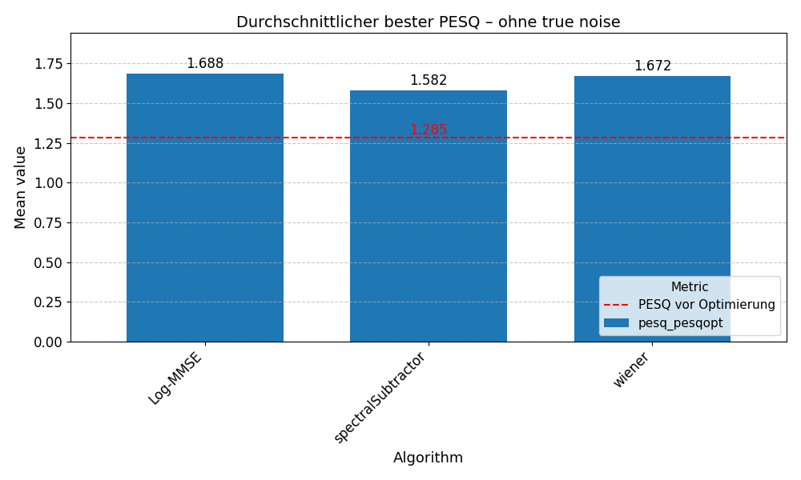
    </p>
  </details>

  <details>
    <summary>2) Best mean STOI per algorithm – estimated noise</summary>
    <p>
      Using estimated noise PSD, the mean best STOI values of all three algorithms lie close together. Since baseline STOI is already relatively high for many samples, improvements remain modest.
    </p>
    <p>
      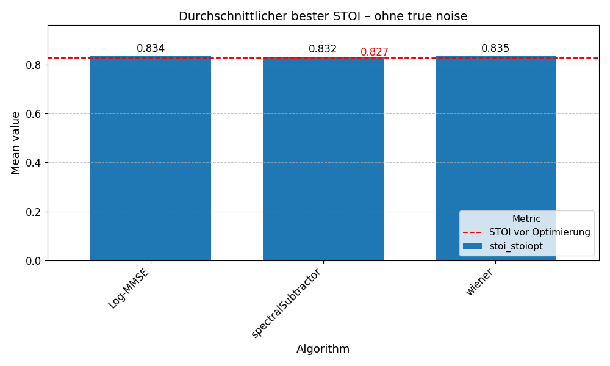
    </p>
  </details>

  <details>
    <summary>3) Best mean PESQ per algorithm – with TrueNoise (oracle)</summary>
    <p>
      Using the true noise power spectrum (oracle noise PSD), all algorithms reach substantially higher PESQ. This highlights the upper bound when noise estimation is perfect. Spectral Subtraction achieves the best average PESQ, followed by Wiener and Log-MMSE.
    </p>
    <p>
      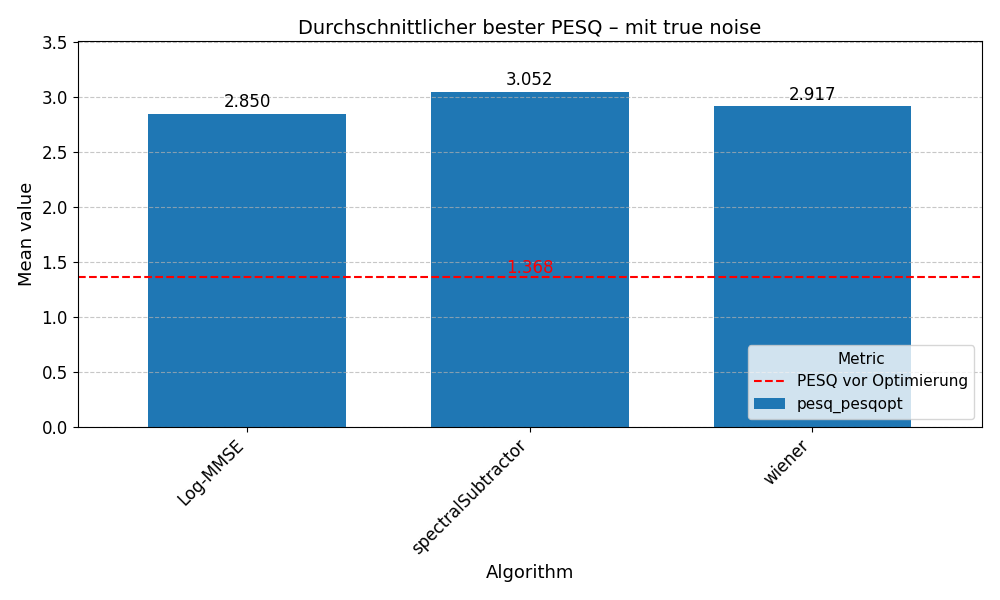
    </p>
  </details>

  <details>
    <summary>4) Best mean STOI per algorithm – with TrueNoise (oracle)</summary>
    <p>
      With oracle noise PSD, intelligibility (STOI) increases noticeably for all algorithms compared to the estimated-noise case. Improvements are larger and showing that STOI gains are strongly bounded by noise estimation quality. Algorithmic differences remain relatively small.
    </p>
    <p>
      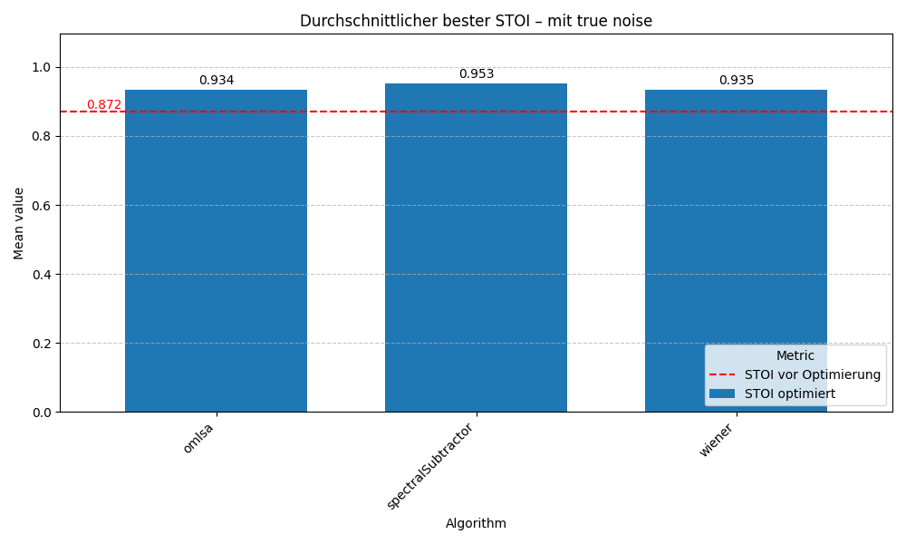
    </p>
  </details>

  <details>
    <summary>5) Mean PESQ on low-quality subset (PESQ ≤ 1.1)</summary>
    <p>
      This plot focuses on files with a lower baseline PESQ (≤ 1.1), representing more adverse starting conditions. After PESQ-optimisation, all methods improve on average, but the absolute PESQ remains limited by the difficult inputs. Differences between algorithms are smaller here, indicating that optimisation is constrained by the scene and noise estimation accuracy.
    </p>
    <p>
      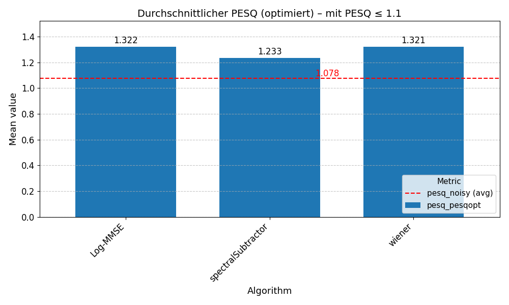
    </p>
  </details>

  <details>
    <summary>6) Mean STOI on low-quality subset (STOI ≤ 0.7)</summary>
    <p>
      To analyse harder intelligibility cases, only files with a low baseline STOI (≤ 0.7) are considered. Even under these adverse conditions, the mean optimised STOI values remain very similar across algorithms, and the overall gains are moderate. This indicates that achievable improvements are constrained and no clear algorithm dominates in this subset.
    </p>
    <p>
      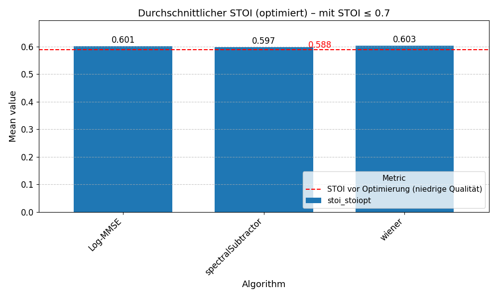
    </p>
  </details>

  <details>
    <summary>7) Trade-off: ΔSTOI vs ΔPESQ (STOI-optimised, estimated noise)</summary>
    <p>
      Each point represents one test sample and shows how STOI-optimisation changes intelligibility (ΔSTOI) and quality (ΔPESQ) relative to the unprocessed baseline, using estimated noise PSD. Most points move towards positive ΔSTOI, confirming that the optimisation primarily improves intelligibility. Among the three methods, the Wiener filter reaches the highest average PESQ.
    </p>
    <p>
      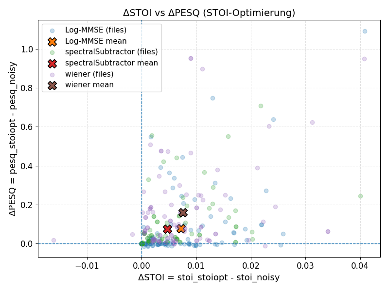
    </p>
  </details>

  <details>
    <summary>8) Trade-off: ΔSTOI vs ΔPESQ (PESQ-optimised, estimated noise)</summary>
    <p>
      This figure shows the same ΔSTOI/ΔPESQ space, but with parameters chosen to maximise PESQ under estimated noise PSD. Points are shifted mainly towards positive ΔPESQ, while ΔSTOI often decreases, illustrating the common trade-off between perceived quality and intelligibility. Algorithm means summarise how strongly each method tends to exchange intelligibility for quality when optimised for PESQ.
    </p>
    <p>
      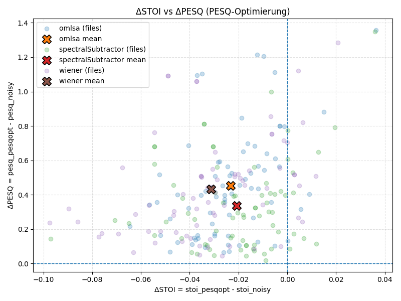
    </p>
  </details>

  <details>
    <summary>9) Variant summary: STOI-opt vs balanced vs PESQ-opt (estimated noise)</summary>
    <p>
      This plot aggregates the mean ΔSTOI and ΔPESQ for different optimisation modes (STOI-focused, balanced/score-based, PESQ-focused) under estimated noise PSD. The positions show how the operating point shifts depending on the target metric: STOI-opt prioritises intelligibility, PESQ-opt prioritises quality, and the balanced setting lies between them. The “balopt” variant maximises a combined score, computed as: <code>score = 0.5 · norm(ΔSTOI) + 0.5 · norm(ΔPESQ)</code> (with both deltas normalised to comparable ranges).
    </p>
    <p>
      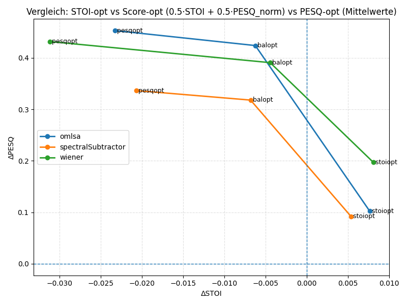
    </p>
  </details>

  <details>
    <summary>10) Heatmap: ΔSTOI (STOI-optimised) by scenario — estimated noise</summary>
    <p>
      The heatmap compares mean intelligibility improvements (ΔSTOI) from STOI-optimisation across scenario categories using estimated noise PSD. The strongest gains are achieved in the <em>Music</em> scenario, while <em>Noise</em> and <em>Voices</em> show clearly smaller improvements. The cell annotations (n) indicate the number of samples per scenario and help interpret how representative each mean value is.
    </p>
    <p>
      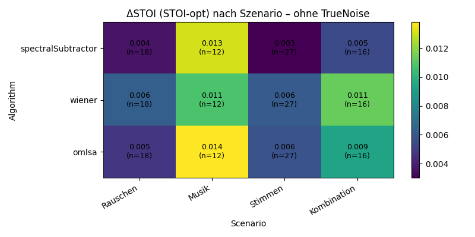
    </p>
  </details>

  <details>
    <summary>11) Heatmap: ΔPESQ (PESQ-optimised) by scenario — estimated noise</summary>
    <p>
      This heatmap compares mean quality changes (ΔPESQ) from PESQ-optimisation across scenario categories using estimated noise PSD. The best results are obtained in the <em>Noise</em> scenario, followed by <em>Music</em>, whereas <em>Voices</em> consistently yields the smallest gains.
    </p>
    <p>
      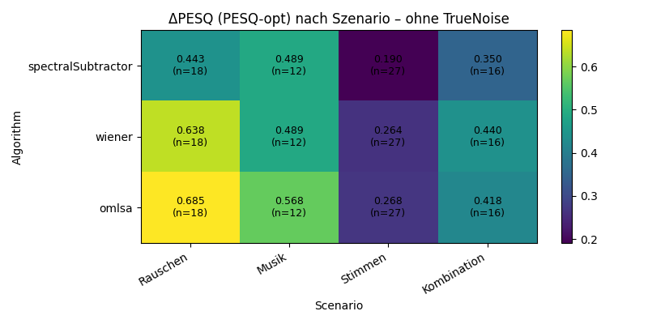
    </p>
  </details>

  <details>
    <summary>12) Heatmap: ΔSTOI (STOI-optimised) by scenario — TrueNoise (oracle)</summary>
    <p>
      This figure shows mean intelligibility improvements (ΔSTOI) per scenario when STOI-optimisation is performed with true noise PSD (oracle). The <em>Voices</em> scenario benefits the most, indicating that with perfect noise knowledge, intelligibility gains are especially strong in competing-speech conditions.
    </p>
    <p>
      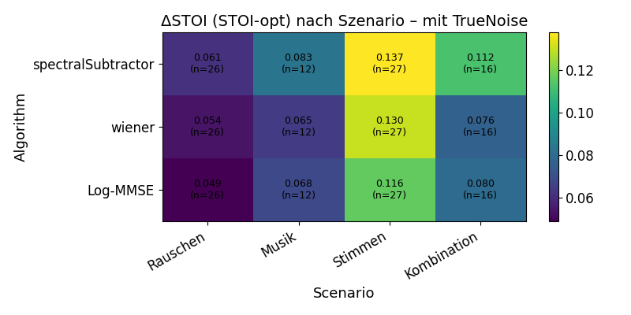
    </p>
  </details>

  <details>
    <summary>13) Heatmap: ΔPESQ (PESQ-optimised) by scenario — TrueNoise (oracle)</summary>
    <p>
      With oracle noise PSD, PESQ-optimisation yields high and comparatively stable ΔPESQ across all scenario categories. The best overall results are achieved in the <em>Combination</em> scenario, closely followed by <em>Music</em>. The weakest gains occur in the <em>Voices</em> scenario, indicating that competing-speech conditions remain the most challenging for quality improvements even with perfect noise knowledge.
    </p>
    <p>
      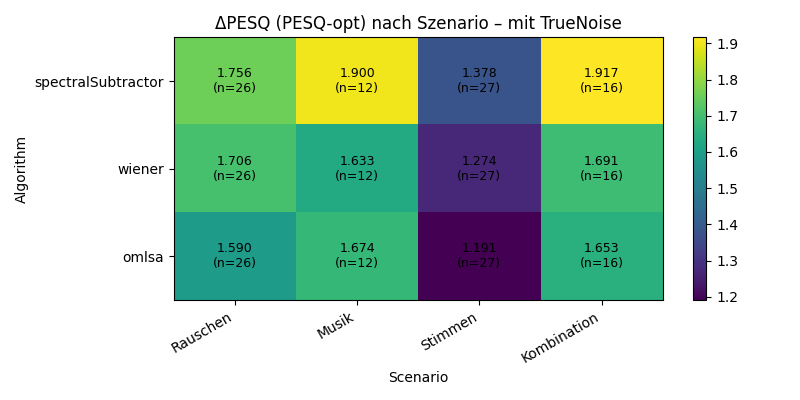
    </p>
  </details>

  <details>
    <summary>14) Noise estimator usage: STOI-opt vs PESQ-opt</summary>
    <p>
      This figure shows how often each noise estimator is selected by the optimisation for STOI vs PESQ. PESQ-optimisation clearly favours <em>min-tracking</em> across all algorithms (dominant share in every case), suggesting it is more beneficial for maximising perceived quality. STOI-optimisation uses <em>percentile</em> much more frequently (especially for the Wiener filter), indicating that intelligibility-driven tuning tends to prefer a more conservative / robust noise estimate in these experiments.
    </p>
    <p>
      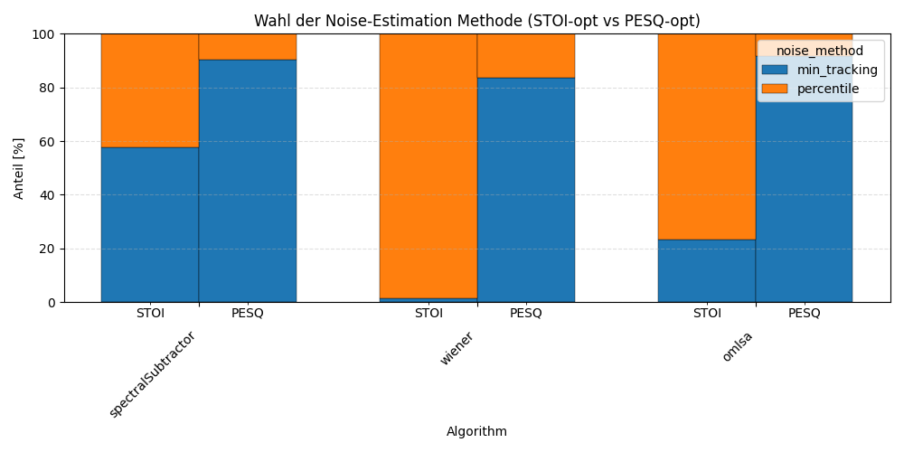
    </p>
  </details>

  <details>
    <summary>15) Oracle gap heatmap: ΔSTOI gain from TrueNoise vs estimated noise (STOI-opt)</summary>
    <p>
      This heatmap quantifies the additional intelligibility improvement enabled by oracle noise PSD under STOI-optimisation: <code>gap = ΔSTOI_trueNoise − ΔSTOI_estNoise</code>. The largest oracle gaps occur in the <em>Voices</em> scenario (highest values across algorithms, up to ~0.134), showing that intelligibility in competing-speech conditions is particularly limited by noise estimation accuracy. The smallest gaps appear in the <em>Noise</em> scenario, where estimation is easier and oracle knowledge adds less benefit.
    </p>
    <p>
      
    </p>
  </details>

  <details>
    <summary>16) Oracle gap heatmap: ΔPESQ gain from TrueNoise vs estimated noise (PESQ-opt)</summary>
    <p>
      Analogously, this plot shows the oracle benefit for quality under PESQ-optimisation: <code>gap = ΔPESQ_trueNoise − ΔPESQ_estNoise</code>. The strongest oracle benefit is seen in the <em>Combination</em> scenario (largest gaps, up to ~1.567), indicating that complex mixtures suffer most from imperfect noise tracking in terms of perceived quality. The smallest gaps occur in simpler conditions (often <em>Noise</em> or <em>Voices</em>, depending on algorithm), where the estimated noise PSD is closer to the oracle and less improvement is unlocked.
    </p>
    <p>
      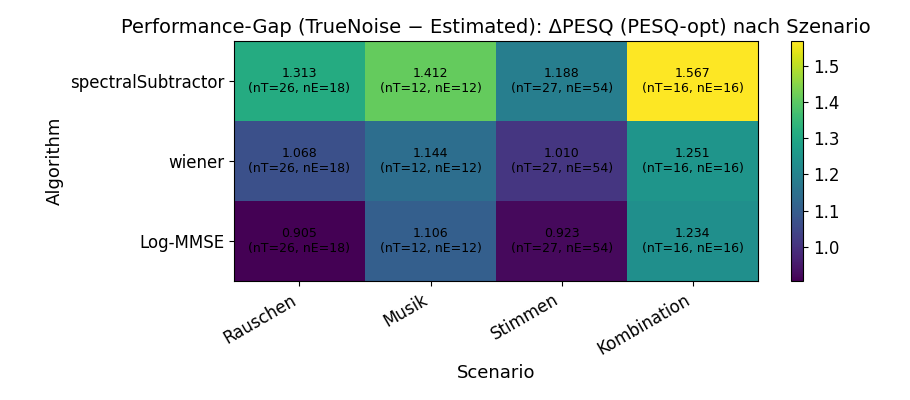
    </p>
  </details>

</details>